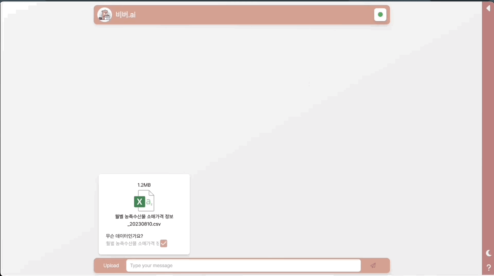
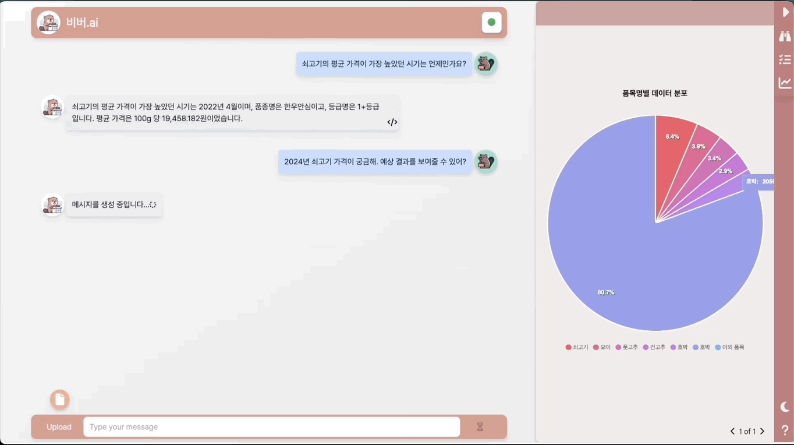
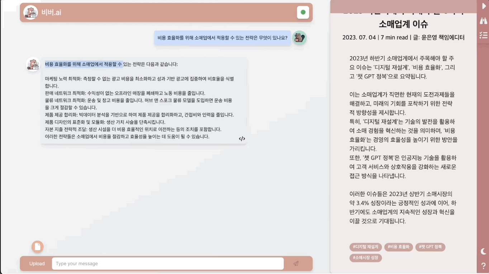

   

    

  
  <h2>비버.ai, 일반 소매업자를 위한 데이터 분석 서비스</h2>

  

    
    
    
    
    
    
    
    
    
    
    
    
  <!-- https://github.com/Ileriayo/markdown-badges for more badge -->

## 비버.ai 소개

- **비버.ai**는 일반 소매업자가 데이터 분석을 쉽게 할 수 있도록 돕는 서비스입니다.
- **소매업 파일을 첨부**하면 맞춤형 대시보드와 데이터 분석 인사이트를 제공합니다.
- **서비스에 LLM을 결합**하여 정규화되지 않은 다양한 데이터를 이해하고, 사용자에게 자연어 인터페이스를 제공합니다.

## 비버.ai 주요 기능

- 파일 내용을 분석하고, 맞춤형 정보로 가공해 대시보드 형태로 제공합니다.
    

    
<b>맞춤형 대시보드</b>

  
    

- 소매업자의 요청에 맞추어 데이터 분석을 돕습니다.
    

    
<b>데이터 분석 지원</b>

    
    
    

- 첨부한 문서로부터 믿을 수 있는 다양한 인사이트를 제공합니다.
    

    
<b>문서로부터 인사이트 제공</b>

  
    

## 팀원 구성 및 역할 분담

|                                                                 **서강문**                                                                  |                                                                  **백범성**                                                                  |                                                               **최승혁**                                                                |                                                              **강민우**                                                              |                                                                 **최보근**                                                                  |
| :-----------------------------------------------------------------------------------------------------------------------------------------: | :------------------------------------------------------------------------------------------------------------------------------------------: | :-------------------------------------------------------------------------------------------------------------------------------------: | :----------------------------------------------------------------------------------------------------------------------------------: | :-----------------------------------------------------------------------------------------------------------------------------------------: |
| [   @KangmoonSeo](https://github.com/KangmoonSeo) | [   @highcloud100](https://github.com/highcloud100) | [   @ColdTbrew](https://github.com/ColdTbrew) | [   @hemaher0](https://github.com/hemaher0) | [   @ChoiBoKeun1](https://github.com/ChoiBoKeun1) |
|                                  팀장  백엔드 개발   LLM 결합 로직 개발  모델 서버 관리                                    |                                       웹 개발 환경 구축  개발 CI/CD 관리   모델 서버 및 최적화                                       |                                     오픈 소스 모델 평가  LLM 로직 개발 지원   모델 서버 관리                                     |                       프론트엔드 개발   대시보드 기획   대시보드 인터페이스 제작  형태소 분석 기획                       |                                  프론트엔드 개발  프론트엔드 프로젝트 관리   채팅 인터페이스 제작                                   |

## 개발 기간

2023.09.26. ~ 2024.02.27. (6개월)

## 서비스 아키텍처

- `React 프론트엔드`, `FastAPI 백엔드`, `GPU 모델 서버`로 구성
- `GPU 모델 서버`는 HuggingFace 오픈 소스 LLM과 OpenAI 교체하며 사용
  - A100, A40 GPU에 오픈 소스 LLM `ldcc-solar-10.7b`, `llama2-13b-dpo-v7` 탑재
  - OpenAI `gpt-3.5-turbo-0125`, `gpt-4-0125-preview`
